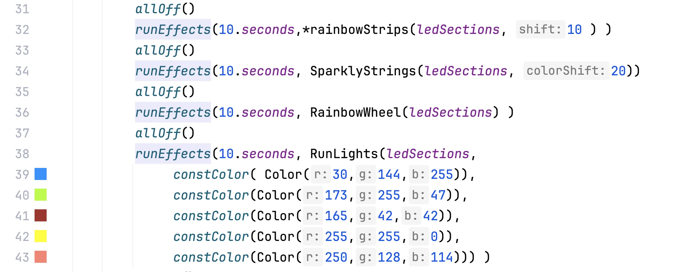
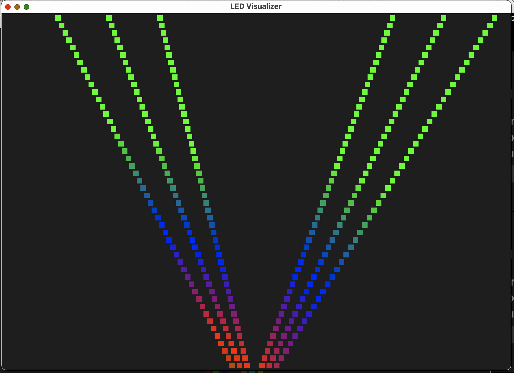

LED Show Generator
---

This generator and visualizer creates sequences of LED effects to be played by
raspberry pi controlling on individually addressable LEDs.

Effects are defined with simple DSL in `GenerateShow.kt` file.




Transfer show runner to Raspberry Pi
---

```bash
./copy-code-to-rpi.sh
```
This will transfer the python code ([run-show.py](run-show.py) )to drive LEDs on Raspberry Pi plus a sample show to run.
Then you can create your own show and transfer it to Raspberry Pi.


Get the visualizer running
---

```bash
mvn package exec:java -Dexec.mainClass="com.kgignatyev.leds.visualizer.PlayShowKt"
```

Create a new show
---
change effects sequence in `GenerateShow.kt` and run
```bash
mvn package exec:java -Dexec.mainClass="com.kgignatyev.leds.GenerateShowKt"
```

then visualizer should reflect the changes and play the show


